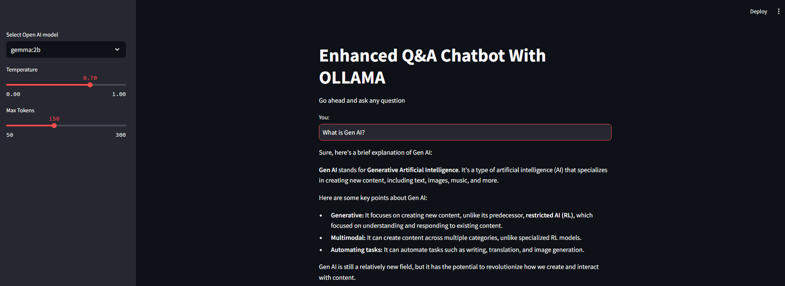

# Enhanced Q&A Chatbot with Ollama and Conversational RAG with PDF

This repository contains two Streamlit applications leveraging Large Language Models (LLMs) for interactive question-answering tasks. The first application is a chatbot using Ollama, while the second enables conversational Q&A with PDF documents using Retrieval-Augmented Generation (RAG).

## Applications Overview

### **Enhanced Q&A Chatbot with Ollama**:
This application is a chatbot powered by the open-source Ollama LLM models. Users can ask questions and receive responses based on their selected model and parameters.

#### Features
- Integration with multiple Ollama models (e.g., Mistral, Gemma:2b, Llama3).
- Adjustable response parameters:
  - Temperature: Controls randomness of responses.
  - Max Tokens: Limits the length of responses.
- Simple and intuitive interface for user input and response display.
- Open-source models—no API key required.

#### How It Works
- Users select an LLM model and adjust response parameters via the sidebar.
- Enter a question in the text input field.
- The chatbot generates an answer using the selected model and displays it.

### **Conversational RAG with PDF**:
This application allows users to upload PDF documents and interact with a chatbot that answers questions based on the uploaded content. It uses Retrieval-Augmented Generation (RAG) to retrieve relevant context from the documents before answering.

#### Features
- Upload multiple PDF files for document-based Q&A.
- Conversational interface with chat history tracking.
- Context-aware question reformulation using history-aware retrievers.
- Integration with Groq's Gemma2-9b-It model for enhanced responses.

#### How It Works
- Users upload PDF files via the file uploader.
- The documents are split into chunks, embedded, and stored in a vector database.
- Users ask questions, and the system retrieves relevant context from the PDFs to generate concise answers.
- Chat history is maintained for context-aware interactions.

